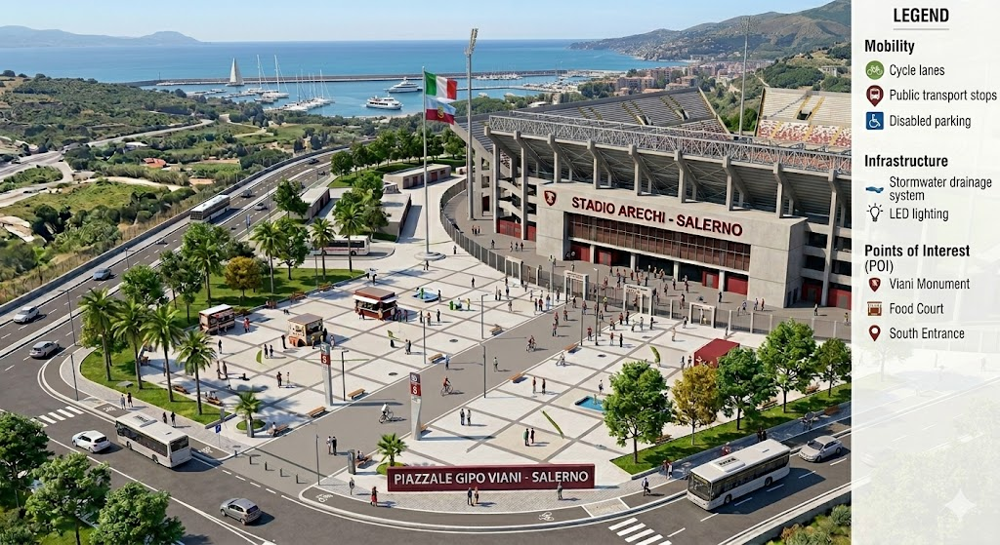

# Arechi Urban Study

A comprehensive urban planning study of Piazzale Gipo Viani and Stadio Arechi area in Salerno, Italy. The repository provides:

- 3‑D model of the site
- Pedestrian flow simulations with adjustable green‑corridor weight factors
- GIS‑based analyses and visualisations
- Detailed concept design documentation

## Table of Contents
- [Project Overview](#project-overview)
- [Installation](#installation)
- [Quick Start](#quick-start)
- [Data & Resources](#data--resources)
- [Analysis Scripts](#analysis-scripts)
- [Documentation](#documentation)
- [Contributing](#contributing)
- [License](#license)

## Project Overview

The study evaluates interventions such as a **green corridor**, solar carports, and public‑space redesign to improve mobility, reduce heat‑island effects, and increase energy self‑sufficiency. See the full report in `docs/report.md`.

## Installation
```bash
git clone https://github.com/msabetta/arechi-urban-study.git
cd arechi-urban-study
python -m venv .venv
source .venv/bin/activate
pip install -r requirements.txt
```

## Quick Start
Run the main Jupyter notebook that orchestrates the workflow:

```bash
jupyter lab notebooks/urban_analysis.ipynb
```

Or execute the pedestrian‑flow comparison directly:

```bash
python -m analysis.pedestrian_flows.flow_difference_map --weight-factor 0.25
```

## Data & Resources
- **OpenStreetMap** extract for Salerno (via `osmnx`)
- Regional GIS layers (ortho‑photos, DTM/DSM) – stored in `data/`
- Raw simulation inputs in `data/sim_inputs/`

## Analysis Scripts
| Script | Purpose |
|--------|---------|
| `analysis/pedestrian_flows/pedestrian_flow_scenario.py` | Simulate baseline and scenario pedestrian flows |
| `analysis/pedestrian_flows/flow_difference_map.py` | Generate Δ‑flow maps highlighting corridor impact |
| `scripts/generate_3d_model.py` | Build the 3‑D city model |

All scripts accept a `--weight-factor` argument to tune the green‑corridor influence.

## Documentation
- `docs/concept_design.md` – design narrative and mermaid diagram  
- `docs/data_acquisition.md` – data collection checklist  
- `docs/references.md` – bibliography and software tools  
- `docs/report.md` – full technical report with figures and results  

## Contributing
Contributions are welcome! Please read `CONTRIBUTING.md` for guidelines, open an issue, or submit a pull request.

## License
This project is licensed under the MIT License.


This project is a comprehensive urban planning study of the Piazzale Gipo Viani and Stadio Arechi area in Salerno, Italy. It includes a 3D model of the area, analysis of mobility and public spaces, and proposals for urban requalification.





## Table of Contents

- [Project Overview](#project-overview)
- [Installation](#installation)
- [Usage](#usage)
- [Data Sources](#data-sources)
- [Contributing](#contributing)
- [License](#license)


Objectives:
- 3D modeling of the area
- Mobility and public space analysis
- Urban requalification proposals

## Installation

```bash
git clone https://github.com/msabetta/arechi-urban-study.git
cd arechi-urban-study
python -m venv .venv
source .venv/bin/activate
pip install -r requirements.txt
```

## Usage

The project is organized as follows:

- `analysis/`: Python scripts for land‑use analysis, GIS processing, etc.
- `scripts/`: Utility scripts such as 3D model generation.
- `notebooks/`: Jupyter notebooks that run the full workflow.
- `visualizations/`: Generated diagrams and maps.
- `data/`: Raw OSM extracts and auxiliary datasets.

To run the main notebook:

```bash
jupyter lab notebooks/urban_analysis.ipynb
```

## Data Sources

- OpenStreetMap extract for Salerno area (downloaded via `osmnx`).
- Local GIS layers for parking, stadium buffers, etc.

## Contributing

Feel free to open issues or submit pull requests. Follow the contribution guidelines in `CONTRIBUTING.md`.

## License

This project is licensed under the MIT License.
