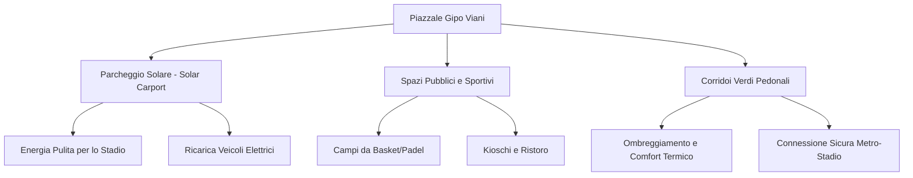

# Concept Design: Rigenerazione Urbana del Piazzale Gipo Viani

Questo documento illustra la proposta di concept design per la riqualificazione e valorizzazione dell'area antistante lo Stadio Arechi (Piazzale Gipo Viani) a Salerno.

## 1. Vision Generale
Attualmente, il Piazzale Gipo Viani è un'immensa distesa di asfalto impermeabile (circa 65.000 mq), utilizzata quasi esclusivamente come parcheggio durante le partite casalinghe dell'U.S. Salernitana 1919 o per eventi sporadici. Negli altri giorni si presenta come un vuoto urbano degradato, che accentua l'effetto isola di calore.
La proposta punta a trasformare quest'area in un **Hub Multimodale Verde ed Energetico**, attivo 365 giorni all'anno.

## 2. I Pilastri del Progetto

### A. Infrastruttura Energetica: Pensiline Fotovoltaiche (Solar Carports)
*   **Intervento:** Installazione di pensiline metalliche dotate di pannelli solari fotovoltaici sopra gli stalli di sosta del parcheggio.
*   **Benefici:**
    *   **Generazione Energetica:** Produzione stimata di circa 3-5 MWp, in grado di alimentare lo Stadio Arechi durante gli eventi e costituire una CER (Comunità Energetica Rinnovabile) per il quartiere circostante ed il vicino ospedale.
    *   **Comfort per la Sosta:** Ombreggiamento delle autovetture in sosta, riducendo drasticamente il calore accumulato dall'asfalto (albedo mitigato).
    *   **E-mobility:** Integrazione di oltre 50 colonnine di ricarica rapida per veicoli elettrici, creando un grande hub di ricarica per la zona est di Salerno.

### B. Parco Urbano per lo Sport e il Tempo Libero
*   **Intervento:** De-pavimentazione di porzioni strategiche di asfalto per inserire pavimentazioni drenanti ed aree verdi attrezzate.
*   **Dotazioni previste:**
    *   Creazione di un'area multisport accessibile gratuitamente ai cittadini (campi da basket 3x3, padel, area calisthenics).
    *   Kioschi commerciali rimovibili con sedute all'aperto all'ombra delle alberature.
    *   Un'arena all'aperto per piccoli eventi e cinema sotto le stelle nei mesi estivi.

### C. Connessione Pedonale Protetta (Green Corridor)
*   **Intervento:** Creazione di un viale pedonale alberato diagonale che connette direttamente l'uscita della Stazione Metropolitana Arechi con l'ingresso principale della Tribuna dello Stadio.
*   **Caratteristiche:**
    *   **Sicurezza:** Percorso separato fisicamente dal traffico veicolare e dai parcheggi tramite siepi e barriere verdi.
    *   **Comfort:** Piantumazione di alberi a foglia caduca (es. Platani o Aceri) che offrono ombra in estate e lasciano passare il sole in inverno.
    *   **Pavimentazione:** Materiali fotocatalitici chiari per ridurre l'assorbimento termico e catturare gli inquinanti atmosferici.

---

## 3. Impatto Atteso
1.  **Riduzione dell'isola di calore:** Abbassamento stimato delle temperature superficiali al suolo da **46°C a 30°C** nelle aree riqualificate.
2.  **Transizione Ecologica:** Produzione di energia rinnovabile pulita a km zero, con riduzione delle emissioni di CO2.
3.  **Vivibilità:** Restituzione di uno spazio pubblico vitale alla cittadinanza salernitana, favorendo la socialità e lo sport.
