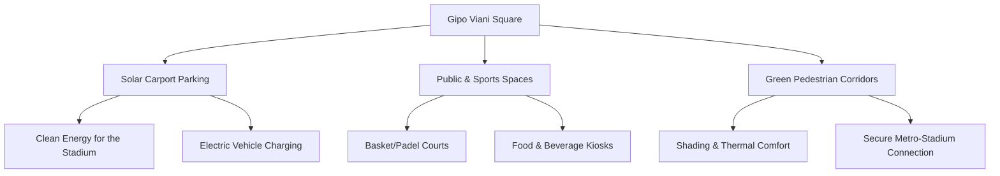

# Concept Design: Urban Regeneration of Gipo Viani Square

This document presents the concept design proposal for the regeneration and valorisation of the area in front of the Arechi Stadium (Gipo Viani Square) in Salerno.

## 1. General Vision

Currently, Gipo Viani Square is an extensive impermeable asphalt surface (about 65,000 m²) used almost exclusively as a parking lot during home matches of U.S. Salernitana 1919 or occasional events. On other days it appears as a degraded urban void, amplifying the heat‑island effect.

The proposal aims to transform this area into a **Green and Energy‑Driven Multimodal Hub**, active year‑round.

## 2. Project Pillars

### A. Energy Infrastructure: Photovoltaic Canopies (Solar Carports)

* **Intervention:** Installation of metal canopies equipped with photovoltaic panels above the parking stalls.
* **Benefits:**
  * **Energy Generation:** Estimated 3–5 MWp, sufficient to power the Arechi Stadium during events and to form a Renewable Energy Community for the surrounding neighbourhood and nearby hospital.
  * **Parking Comfort:** Shade for parked vehicles, dramatically reducing heat buildup on the asphalt (higher albedo).
  * **E‑Mobility:** Integration of more than 50 fast‑charging stations for electric vehicles, creating a major charging hub for the eastern part of Salerno.

### B. Urban Park for Sport & Leisure

* **Intervention:** Depaving strategic portions of the asphalt to insert permeable pavements and equipped green areas.
* **Provisions:**
  * Creation of a free‑access multisport area (3x3 basket courts, padel, calisthenics zone).
  * Removable commercial kiosks with outdoor seating shaded by planted trees.
  * An open‑air arena for small events and summer star‑gazing cinema.

### C. Protected Pedestrian Connection (Green Corridor)

* **Intervention:** Creation of a diagonal tree‑lined pedestrian avenue directly linking the exit of the Arechi Metro Station with the main entrance of the Stadium Tribune.
* **Features:**
  * **Safety:** Path physically separated from vehicular traffic and parking areas by hedges and green barriers.
  * **Comfort:** Planting of deciduous trees (e.g., plane or maple) that provide shade in summer and allow sunlight in winter.
  * **Pavement:** Light‑colored photocatalytic materials to reduce thermal absorption and capture atmospheric pollutants.

---

## 3. Expected Impact

1. **Heat‑Island Reduction:** Estimated surface temperature drop from **46 °C to 30 °C** in the regenerated zones.
2. **Ecological Transition:** Production of clean, zero‑km renewable energy, reducing CO₂ emissions.
3. **Livability:** Restoring a vital public space for the citizens of Salerno, fostering social interaction and sport.
