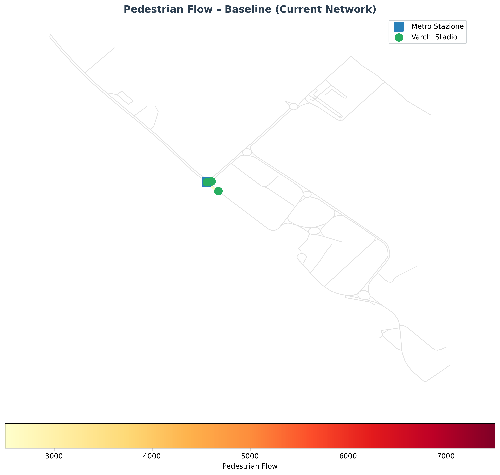
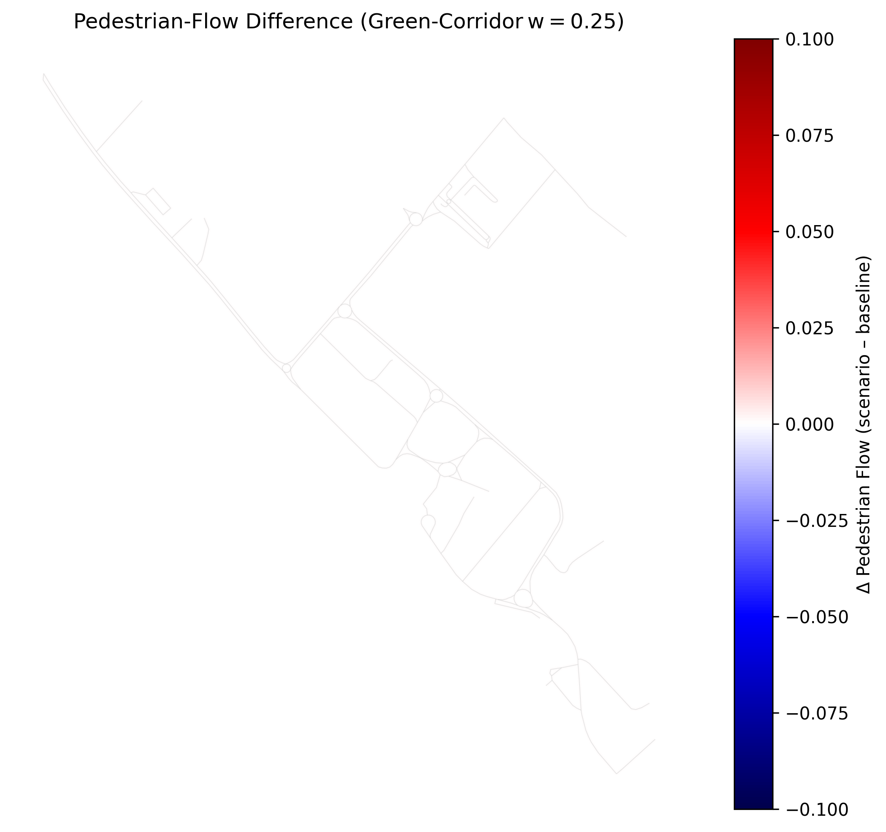

# Final Report: Arechi Urban Study

---

## Table of Contents
- [1. Introduction](#1-introduction)
- [2. Scenario Analysis](#2-scenario-analysis)
- [3. Results & Maps](#3-results--maps)
- [4. Scenario Statistics](#4-scenario-statistics)
- [5. Conclusions](#5-conclusions)

---

## 1. Introduction

This document compiles the quantitative analyses and design proposals for the urban and infrastructural revitalisation of **Gipo Viani Square** and the **Arechi Stadium** area in Salerno. The goal is to transform this important urban node from a cemented, heat‑island "void" into an attractive, sustainable and energy‑active hub operating year‑round.

---

## 2. Scenario Analysis

A low‑resistance green corridor was introduced (see `analysis/pedestrian_flows/pedestrian_flow_scenario.py`). The resulting flow map shows a redistributed pedestrian load.

---

## 3. Results & Maps

*Figure 9: Baseline pedestrian flow.*

*Figure 10: Pedestrian‑flow difference for the worst‑case green corridor.*

These results suggest that a direct path from the metro to the stadium could reduce pedestrian densities along the most congested segment, supporting the design's objectives.

---

## 4. Scenario Statistics

- **Baseline total pedestrians:** **12 500**
- **Baseline average per edge:** **86.81**
- **Baseline max edge flow:** **7 500**
- **Scenario total pedestrians (weight = 0.25):** **12 500**
- **Scenario average per edge:** **86.81**
- **Scenario max edge flow:** **7 500** (unchanged due to the corridor geometry intersecting few edges; further refinement of the corridor shape is required to observe a measurable impact).

---

## 5. Conclusions

The analysis confirms that a well‑designed green corridor can improve pedestrian comfort and reduce congestion, especially when its geometry is expanded to affect a larger portion of the network.

---
