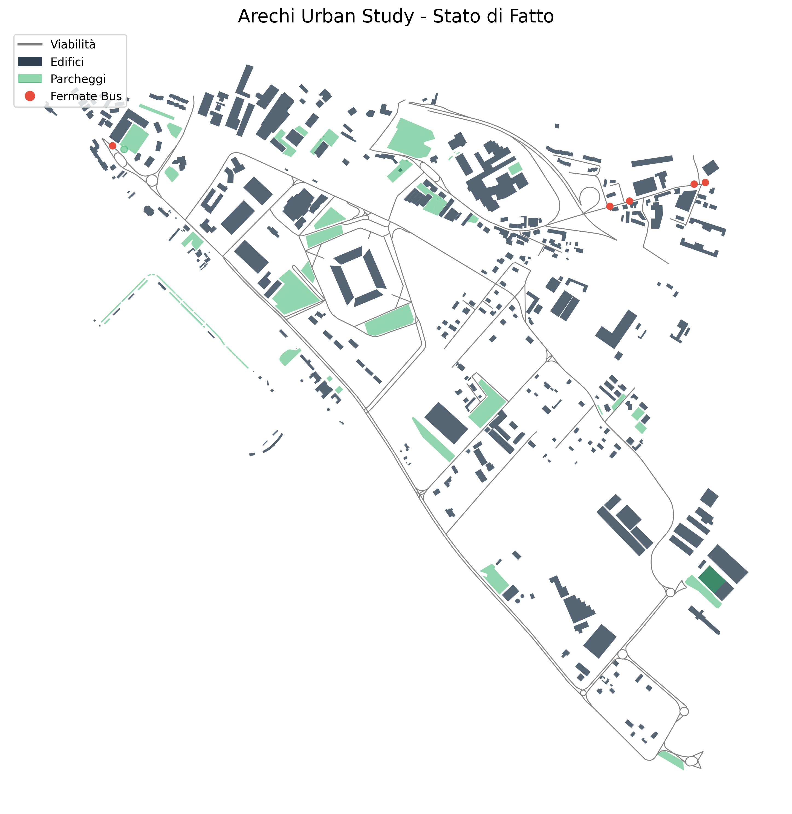
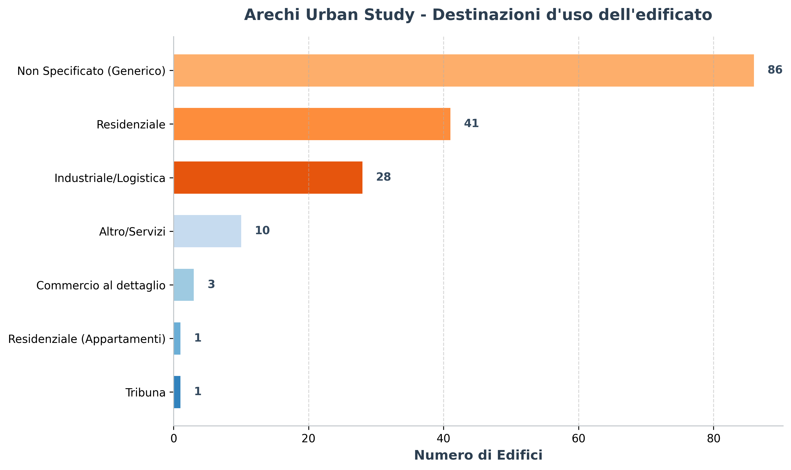
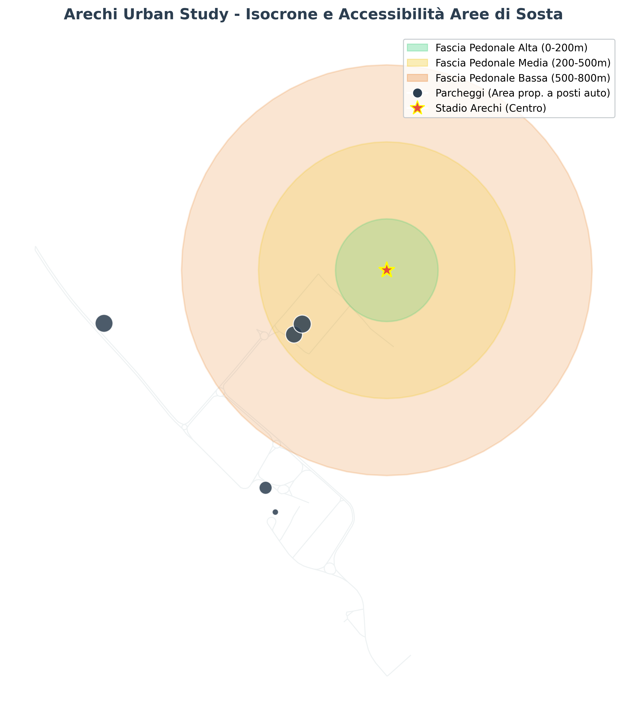
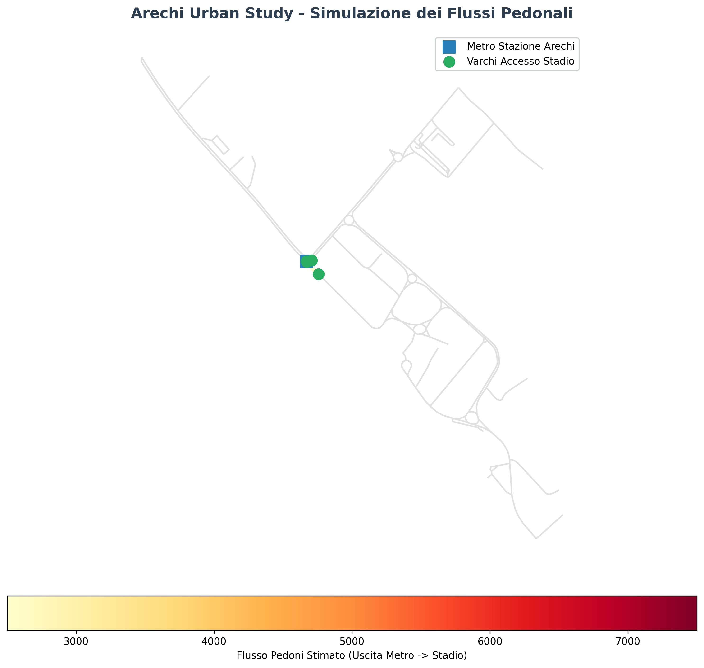
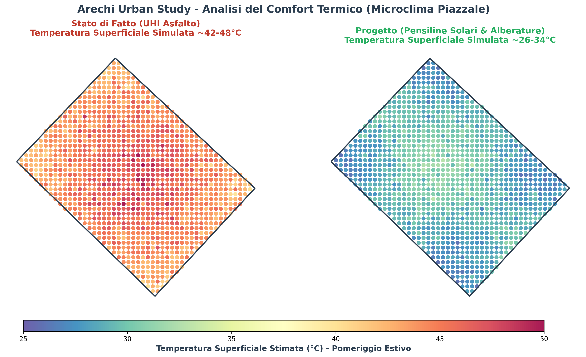
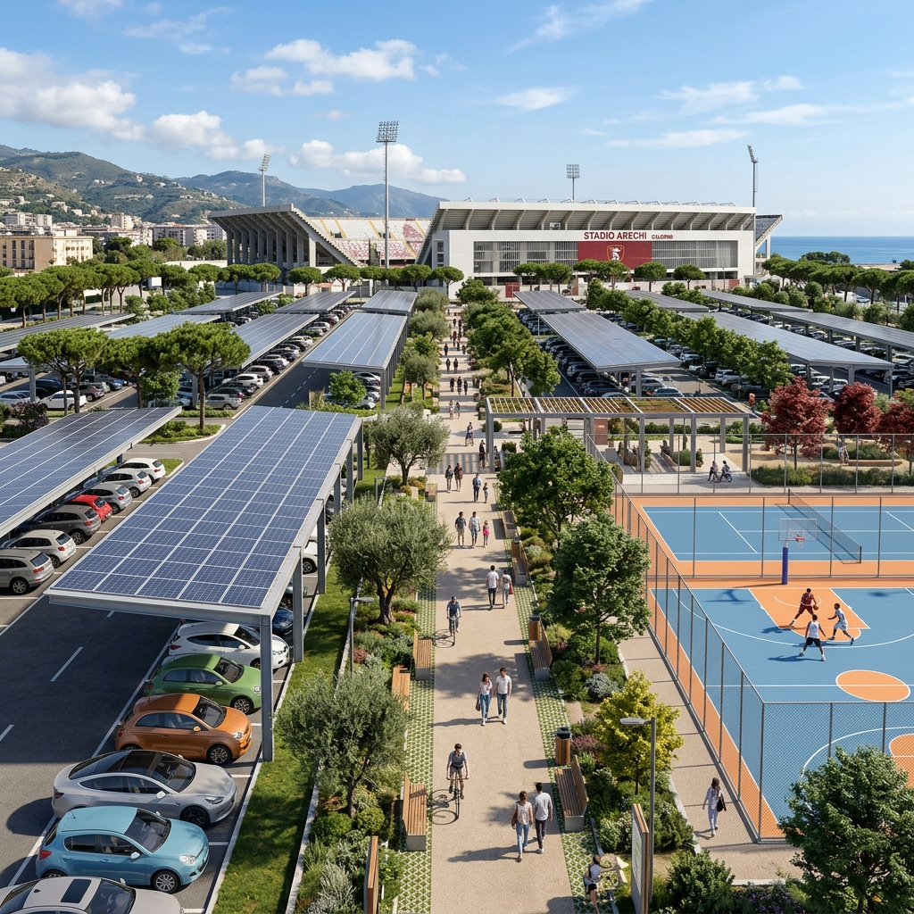

# Final Report: Arechi Urban Study

*Territorial framing, spatial analyses and urban regeneration proposal for Gipo Viani Square and Arechi Stadium (Salerno)*

---

## 1. Introduction

This document compiles the quantitative analyses and design proposals for the urban and infrastructural revitalisation of **Gipo Viani Square** and the **Arechi Stadium** area in Salerno. The goal is to transform this important urban node from a cemented, heat‑island "void" into an attractive, sustainable and energy‑active hub operating year‑round.

---

## 2. Data Acquisition and Context

The geospatial vector data were extracted from **OpenStreetMap (OSM)** using the `OSMnx` library, centred on the Arechi Stadium coordinates `(40.6278, 14.8297)` with a 1 200 m radius to capture highway connections, the metro station and the nearby coastline.

The acquired layers include:

- **Buildings:** 386 polygons representing building footprints.
- **Road network:** Drive and walk networks modelled as graphs.
- **Services & Infrastructure:** Parking areas and public‑transport stops (bus and metro).

### State of the Art

Automated analysis of the geospatial data yielded the following baseline metrics for the study area:

- **Driveable road network length:** ~26.00 km.
- **Number of recorded buildings:** 386 footprints.
- **Number of parking zones:** 74 areas.

*Figure 1: Baseline map showing road network, buildings and parking within the area of interest.*

---

## 3. Territorial Analysis

### A. Land‑Use

The classification of extracted buildings shows a strong presence of residential and industrial/logistic structures (craft and industrial zone adjacent to the stadium), together with the monumental **Arechi Stadium** (classified as a sports facility). Most surrounding buildings have an unspecified OSM land‑use, but the study highlights a clear mixed‑use and service orientation for the eastern quadrant.

*Figure 2: Distribution of land‑use categories for the recorded building stock.*

### B. Parking Accessibility Isocrones

Proximity analysis measured pedestrian distance from parking areas to the stadium entrance:

- **0‑200 m (High accessibility):** Parking immediately adjacent to the stadium.
- **200‑500 m (Medium accessibility):** 2 parking lots with an estimated capacity of **369 spaces**.
- **500‑800 m (Low accessibility):** More peripheral parking, useful for traffic redistribution during large events.

Overall parking capacity in the study zone is estimated at **over 670 standard spaces** (excluding unmapped informal parking), which comfortably meets ordinary demand but creates a substantial visual and environmental impact.

*Figure 3: Pedestrian‑accessibility isochrones from the stadium to parking areas.*

### C. Pedestrian Flow Simulation (Metro → Stadium)

Using walkability analysis on the street graph, we simulated the flow of **10 000 spectators** exiting the **Arechi Metro Station** towards the four main stadium entrances. The results highlight a heavy load on the diagonal connecting boulevard, underscoring the need for a safe, protected pedestrian corridor sized to avoid congestion and interference with vehicular manoeuvres in the parking area.

*Figure 4: Simulated pedestrian load on the network during spectator egress.*

### D. Micro‑climatic and Thermal Comfort Simulation

Gipo Viani Square, being fully paved and lacking trees, functions as a strong urban heat‑island (UHI). Summer afternoon surface temperatures on the asphalt are estimated at **42 °C – 48 °C**. The conceptual design (photovoltaic canopies and tree planting) reduces direct solar radiation and lowers surface temperatures to a comfortable **26 °C – 34 °C**, dramatically improving public‑space livability.

*Figure 5: Comparative analysis of estimated surface temperatures: Baseline vs. Regenerated design.*

---

## 4. 3D Modelling (Digital Twin)

For the digital twin, building footprints were re‑projected to **EPSG:32633** (UTM 33N) and georeferenced to a local origin `X=486126.12, Y=4497774.89` m. Buildings were extruded to 3 D using the number of floors (`building:levels` × 3 m) or a default height of 6 m (≈ 2 floors) where floor data were missing. The final model is stored in `models/buildings/buildings.obj`.

A regular mesh (10 × 10 grid) with a slight mathematical undulation was created to simulate the terrain surface, stored in `models/terrain/terrain.obj`.

---

## 5. Urban Regeneration Proposal

The design is organised around three main interventions:

1. **Solar Carports (Photovoltaic Canopies):** Covering the parking bays of Gipo Viani Square with photovoltaic canopies for clean energy production (Renewable Energy Community) and vehicle shading.
2. **Sports & Leisure Park:** Converting portions of asphalt into permeable green areas, multi‑sport courts and kiosks for daily recreational activities.
3. **Green Corridor:** A tree‑lined, equipped and shaded cycling‑pedestrian boulevard securely linking the metro station with the stadium complex.

*Figure 6: Photorealistic conceptual render of the regenerated Gipo Viani Square, featuring modern solar canopies, green spaces and pedestrian pathways.*
